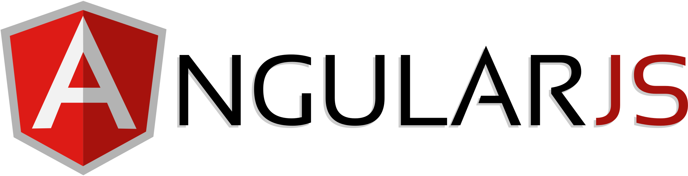

 
 <h1 > I'am KrishnaMohan
 

   
   ###### Full Stack Developer
  

 
 </h1>
 

    <h4 >Qualification  : Bachelor of Technology &#127891;</h4>
    <h4>Branch : Electronics And Communicaton Engineering  &#128187;</h4>
    <h4>Year : 2019 &#128197;</h4>
     <h4>Mail : krishnamohan.pyneni@yahoo.com  :e-mail:</h4>
   

 
 <h1 align="center">:man_technologist: Technologies</h1>
 

     
     
     
     
     
     
     
     
      
     
     
     
     

  
  

    <h1 align="center">:link:Connect </h1>
     
     
  

<!--  -->
<!--  -->
<!--  -->
<!--  -->
<!--   -->
<!--  -->
<!--  -->

<!--  -->
<!--  -->

<!--  -->

<!--  -->
<!-- ### Imagination is more Important than Knowledge :brain: -->
<!--
**krishnamohan-code/krishnamohan-code** is a ✨ _special_ ✨ repository because its `README.md` (this file) appears on your GitHub profile.

Here are some ideas to get you started:

- 🔭 I’m currently working on ...
- 🌱 I’m currently learning ...
- 👯 I’m looking to collaborate on ...
- 🤔 I’m looking for help with ...
- 💬 Ask me about ...
- 📫 How to reach me: ...
- 😄 Pronouns: ...
- ⚡ Fun fact: ...
-->
